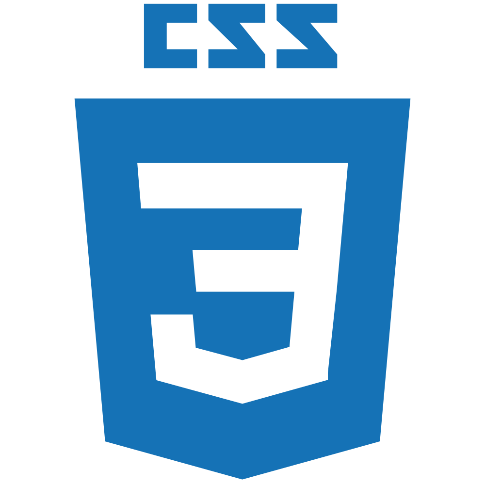
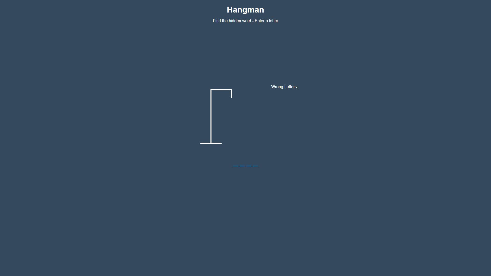
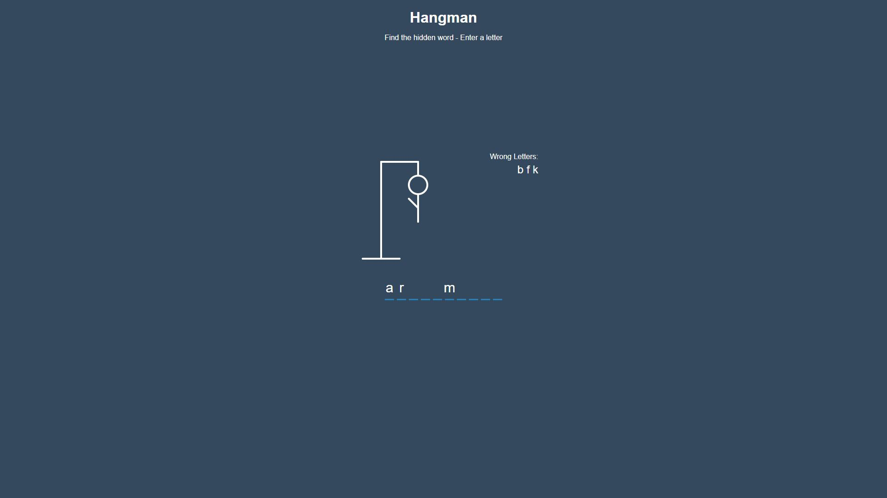
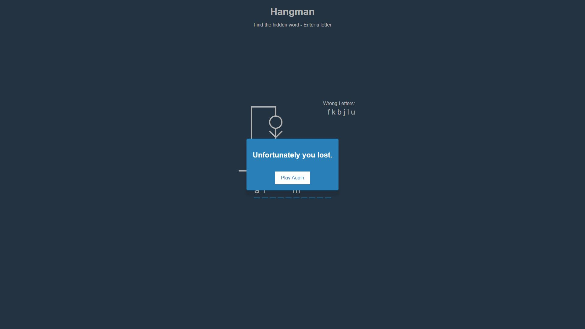

# Hangman

Hangman is an old school word game where the goal is to simply to find the missing letters of a word/phrase.

## How to Play?

You will be presented with a number of blank spaces representing the missing letters you need to find.

Use the keyboard to guess a letter (I recommend starting with vowels).

If your chosen letter exists in the answer, then all places in the answer where that letter appear will be revealed.

After you've revealed several letters, you may be able to guess what the answer is and fill in the remaining letters.

Be warned, every time you guess a letter wrong you loose a life and the hangman begins to appear, piece by piece.

Solve the puzzle before the hangman dies.

## Playing the Game

A live version of the game can be played [here](https://iamkhattar.github.io/hangman/).

## Documentation

The documentation for this repository can be viewed [here](https://iamkhattar.github.io/hangman/play).

## Installing Dependencies

This repository requires additional dependencies to be installed to function as intended. To install these dependencies, please use the following command in the root directory.

```bash
npm install
```

## Running the Application in Developer Mode

To run the application, please use the following command in the root directory.

```bash
npm start
```

## Technology Stack

### Application

   

### Development

  

## Application

|  |  |  |
| ---------------------------- | :--------------------------: | ---------------------------: |


## Contributors

<a href="https://github.com/iamkhattar"></a>

## License

MIT
